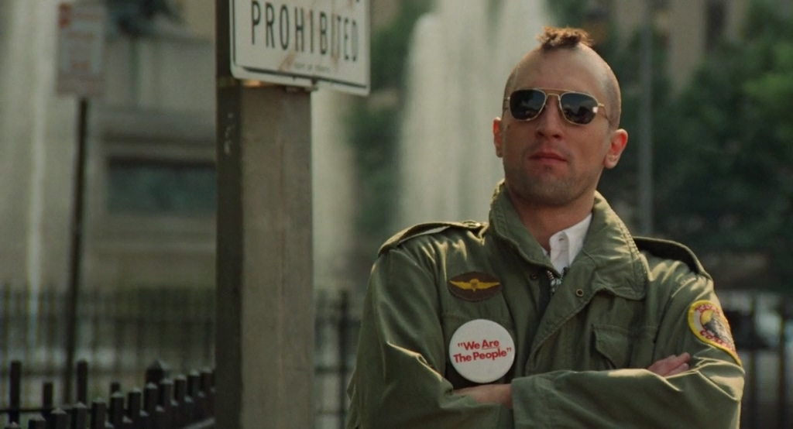

# Image2Event



Towards unsupervised domain adaptation on event data via labeled image data.

## Training

```python
python train.py
```

Default network setting is res2net (or resnet18) as Backbone, FPN as Detection Head, FCN as Upsampling & Downsampling Decoder.

## Inference

```python
python train.py --resume "ckpt_path" -e
```

Results stored in the "Inference" directory.
